# 1. Home screen

Here, a simple signup or account creation.

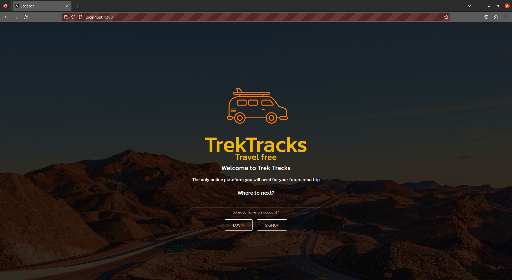

# 1.1 Signup

Here you can create your account, the account can be any other information.
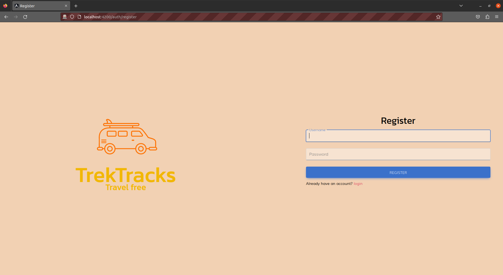

# 1.2 Login

Login is similar to signup, here, well you login

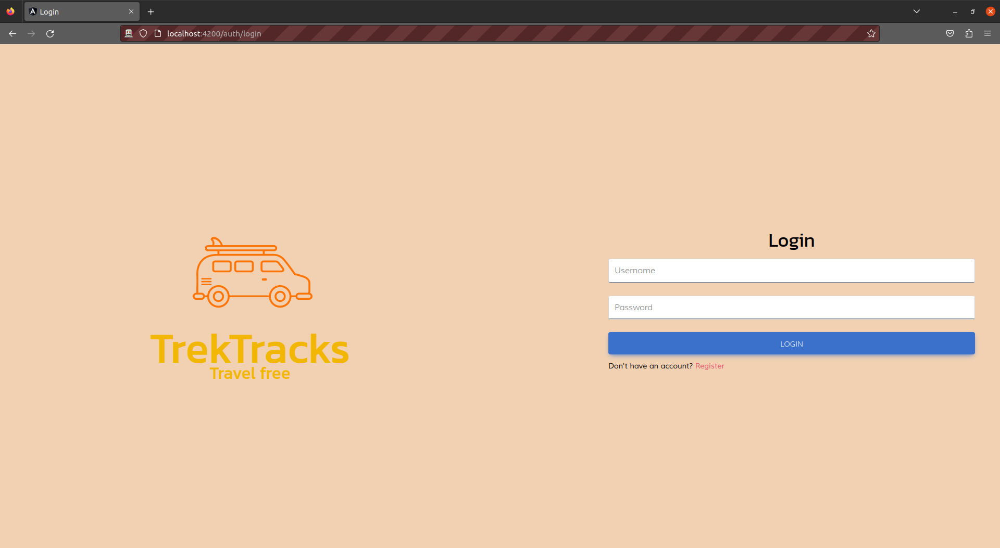

# 2 Dashboard

Here you can see your trips and past trips (if you have any)

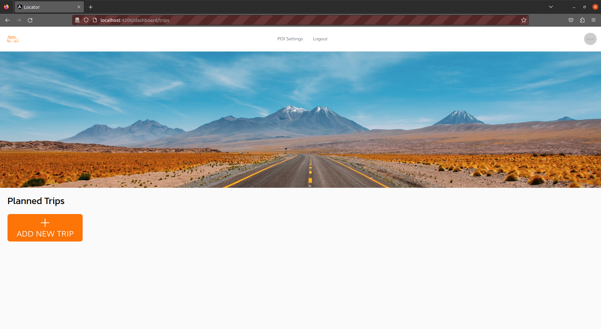

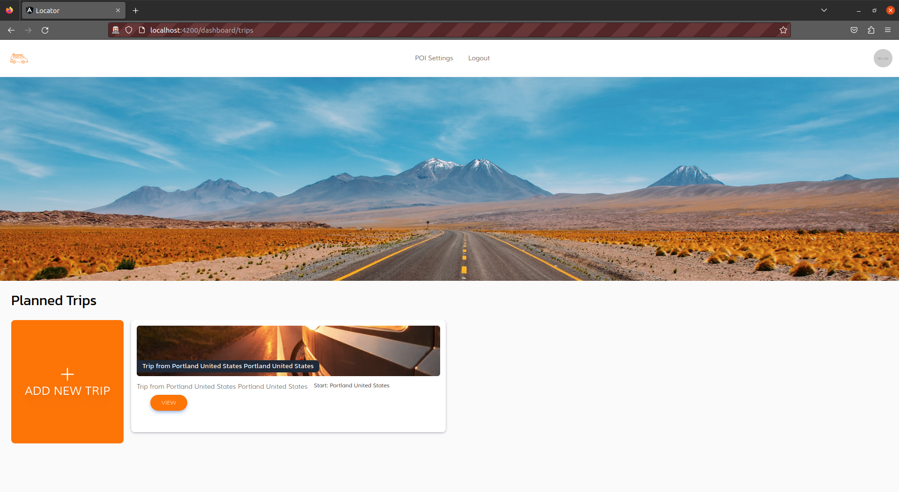

# 2.1 Create a new trip

You can create a new trip with this multi step form.

A trip does not necessarily have to have an ending point, you just have to know where to start ;)

On each screen of your trip, you will see it's Title, Description and Date. All these information are editable once you click the `Edit infos` button.

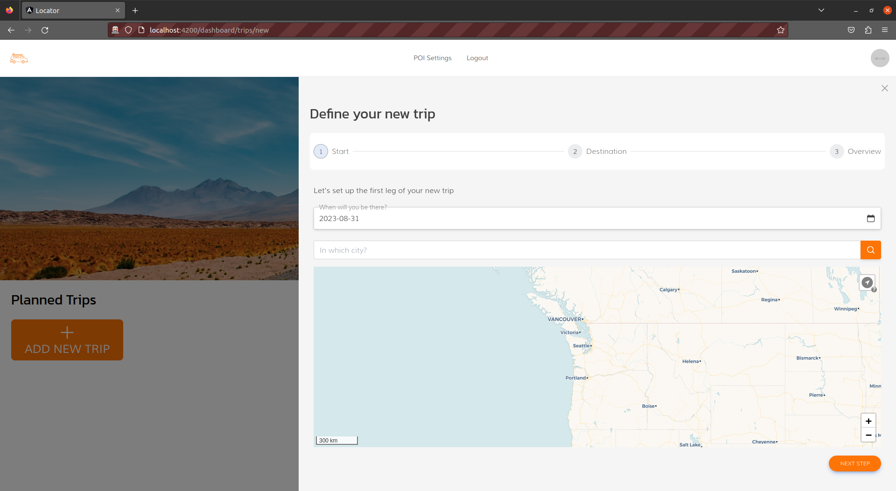
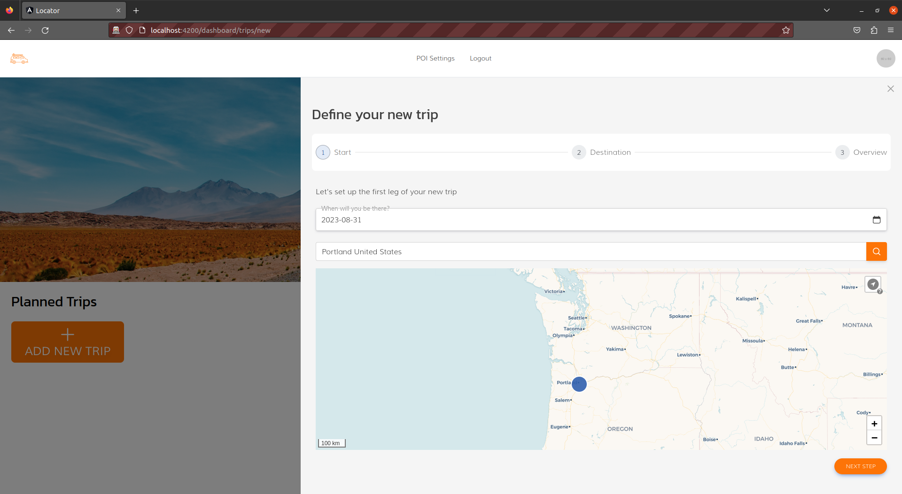
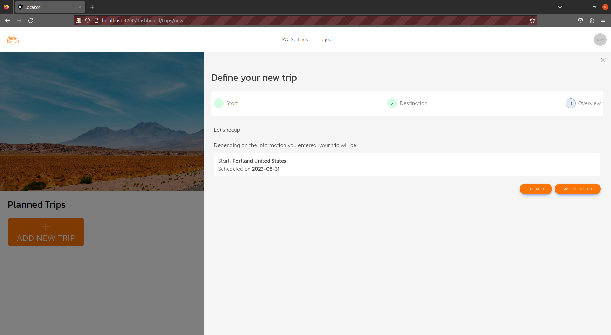

# 3 My brand new trip

Here you can see the overview of the trip you just created, this includes all the places (towns) you want to visit

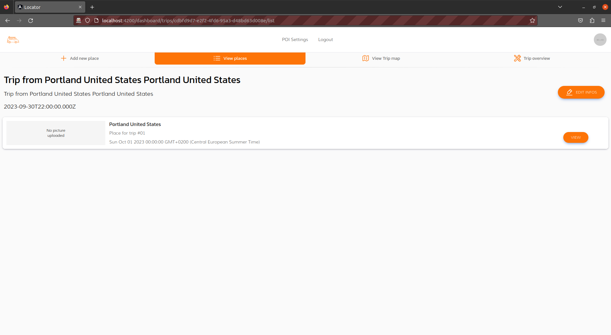

# 3.1 Add a new place

Here you can simple add a new leg to your trip. This new place will be appended to your places and you can re-order it afterwards.

# 3.2 Place list

Here you have all the places of your trip in a list style fashion. Here you can re-order the places of your trip.

# 3.3 Trip map

Here you can view your trip on a map, with directions between each places.
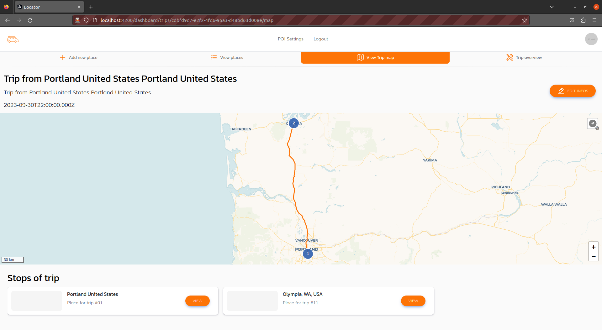

# 3.4 Trip overview

This tab allows you to do tasks on your trip, such as:
- Deleting your trip
- Stopping your trip
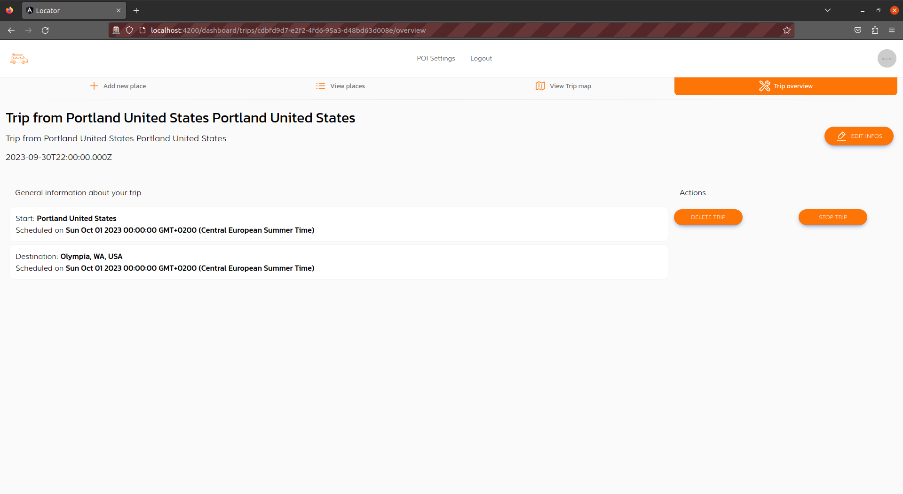

# 4 Place detail

You may have noticed that almost every screen on your trip has a a way for you to view the place in question.
This will popup the place on the side and show it as is
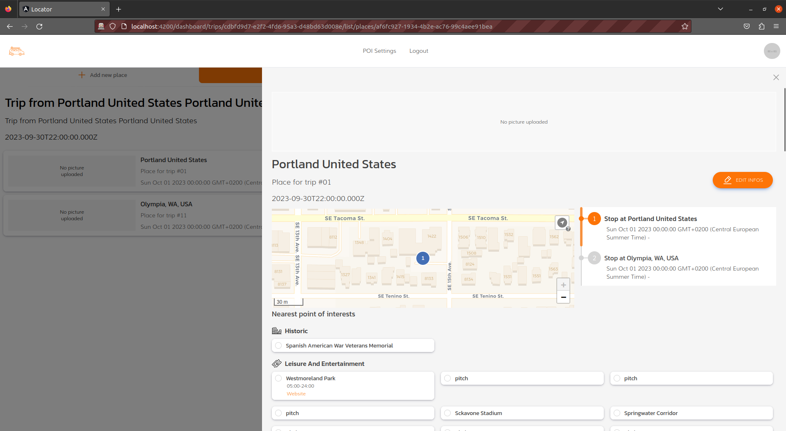

# 4.1 Poi

Here you can see the list of points of interest associated with a place. These can range from any kind of places.
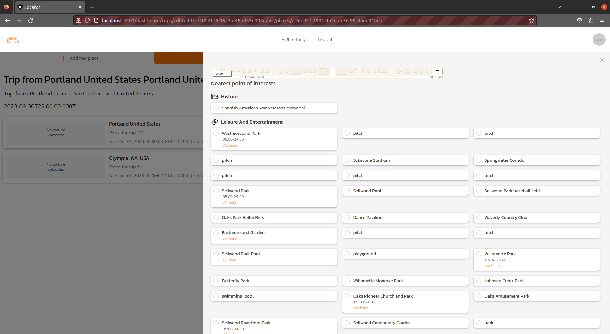

# 5 Settings

Here on the settings you can change a couple of things, the most important is:
- the poi settings

This allows you to define which pois should be searched when showing a place on any trip.
It is a general filter, and allows you to enable some categories and not others depeding on your needs.

By default, none are activated so it will search everything.

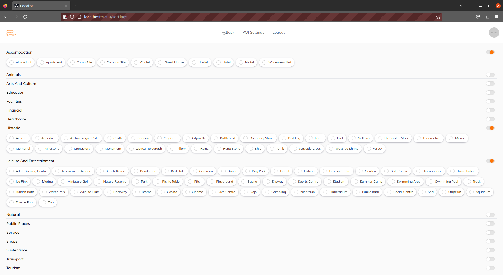
